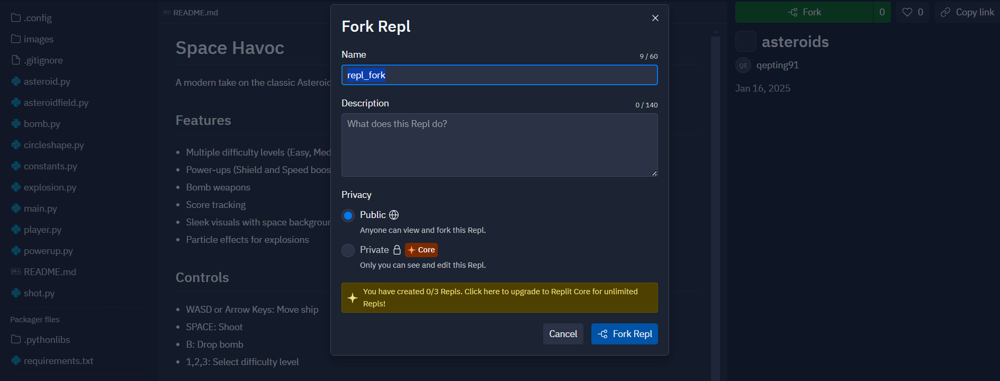
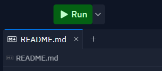
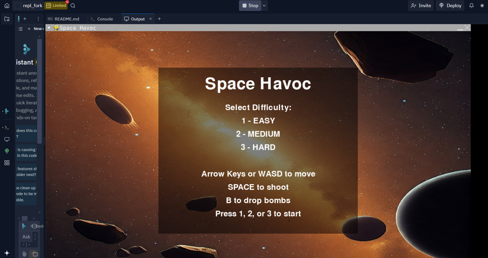

# Space Havoc

A modern take on the classic Asteroids arcade game built with Pygame.

## Features
- Multiple difficulty levels (Easy, Medium, Hard)
- Power-ups (Shield and Speed boosts)
- Bomb weapons
- Score tracking
- Sleek visuals with space background
- Particle effects for explosions

## Controls
- WASD or Arrow Keys: Move ship
- SPACE: Shoot
- B: Drop bomb
- 1,2,3: Select difficulty level

## Game Elements
- Destroy asteroids to earn points
- Collect power-ups for temporary advantages
- Shield power-up provides temporary invulnerability
- Speed boost increases maneuverability
- Bombs clear nearby asteroids

## Scoring
- Large Asteroids: 20 points
- Medium Asteroids: 50 points  
- Small Asteroids: 100 points

## Run on Repl.it
1. Visit the Space Havoc Repl: [https://replit.com/@qepting91/asteroids](https://replit.com/@qepting91/asteroids)
2. Click "Fork" to create your own copy

3. Hit the "Run" button to start the game

4. Play Space Havoc in your browser!

Feel free to modify the game constants in the code to customize your experience!

Built with Python and Pygame, featuring smooth controls and engaging gameplay!# asteroids